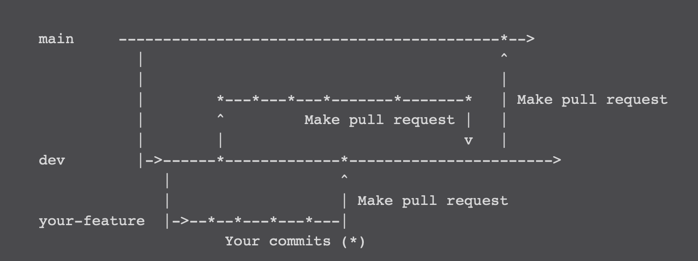

# Branching Strategy
- ```main```: This is our production branch. At the end of each iteration a pull request should be made to `main` from `dev` branch. Only the `dev` branch will be made off of here.
- ```dev```: This our "working" branch. All work in progress being made towards each iteration will be done here.
- *```feature```* : All feature branches will be checked out from `dev`, and merged back once the feature is finished.

## Pull requests 
All PRs should have a brief description of what was changed.

Before any PR you should merge  `dev`  into your feature branch. If there are merge conflicts and you are unsure of how to best resolve them ask for help -- probably the peron whose code you are in conflict with. Please check to make sure that everything still works properly after resolving the conflicts.

### 0 Approvals

 If the changes you have made are trivial (formatting, typo fixes, etc) please go ahead and merge it yourself, no approvals required.

### 1-2 Approvals

-   Any functional code being added needs at least 2 approval.
-   All significant changes/additional code i.e., requiring a unit test, needs to be approved by at least 3 team members.

### 4 Approvals

-   If the PR is being made to  `main`, it should be reviewed and approved by at least 5 team members before merging.

### Snapshot

