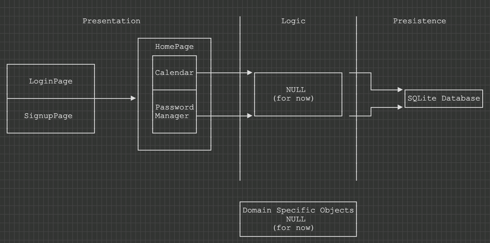

# Architecture

The architecture for our project organizes our files into their respective OSI layers. We organized our class files into respective folders for what they accomplish within the project.

## OSI Layer

- **Logic**
  - This layer of our project is where the application and business logic are located. For this iteration, we did not have any meaningful logic that would have to be separated into this folder. It remains empty for this iteration but will be populated in the next.
- **Objects**
  - Our objects remained the same from the last iteration - where we had created files for a dummy database that was then replaced with our SQLite implementation.
  - We will be expanding on this layer in the comming iteration as we will be creating more object types to work within our different features.
- **Persistence**
  - This layer is where our database implemtation is. Our SQLite implementation persists through restarts of the application and stores all user data.
- **Presentation**
  - The presentation layer has grown within this iteration with the addition of a new feature and more expansion on our GUI layer.
    - A password manager was added that had many more GUI elements that had to be added to the project

## Diagram

Here is a visual representation of what our architecture looks at the end of Iteration 2:

