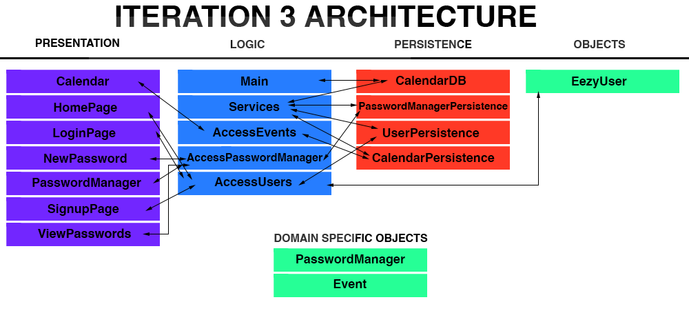

# Architecture

The architecture for our project organizes our files into their respective OSI layers. We organized our class files into respective folders for what they accomplish within the project. This is the state of the application for the final release of our application.

## Architecture Model

### Logic

This layer of our project handles the logic throughout our code. All manipulation to our database (adding, removing, editing, listing, etc.) is handled on this layer. The files that are in this layer are separated to better organize our code and make their individual purposes clear.

### Objects

Objects in our project are used to create users which will have their own individualized calendar events and password managers. Any new account that is created on the application will have their own instance of the application and the state will not be changed by other accounts.

### Persistence

In this layer, we have implemented a *HyperSQL Database* where interfaces state information that will remain throughout the application through restarts. This data will remain with their respective user regardless of the application being closed and reopened.

### Presentation

The presentation layer represents the front-end elements of the application. Meaning, the files in this layer are used to display all user interfaces and allows the user to interact with our application. Files are clearly named with their respective role in the application.

## Diagram

Here is a diagram to visualize our architecture for the final release of our project:

